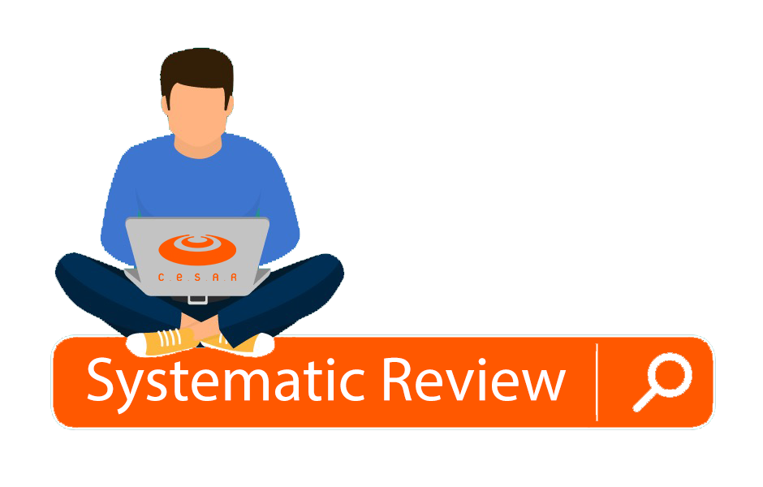

# Aula Revisão Sistemática - Cesar School

Ambiente no qual será disponibilizado material da aula de Revisão Sistemática Métodos e Ferramentas.

> Professor: **[Luciano de Aguiar Monteiro](http://www.lucianoaguiar.com.br)** E-mail: lam@cesar.school
> 
> Professor: **[Washington Almeida](http://www.profwashingtonalmeida.com.br)** E-mail: whca@cesar.school

## Apresentação

Slide Revisão Sistemática [Clique Aqui](manuscript/anexos/Slide_Systematic_Review.pdf)

## Gravação da Aula

## Ferramentas

<b>Mendeley</b> - Gerenciador de Referências Bibtex. [Download](https://www.mendeley.com/download-desktop-new/) 

<b>Zotero</b> - Gerenciador de Referências Bibtex. [Download](https://www.zotero.org/download/) 

<b>Rayyan</b> - Ferramenta on-line para execução da Revisão Sistemática dentro do seu ambiente. [Acesso](https://rayyan.qcri.org/welcome) 

<b>Overleaf</b> - Editor web de escrita colaborativa LaTeX e Rich Text e de publicação. [Acesso](https://www.overleaf.com/) 

<b>JabRef</b> - Organizador de referência em formato Bibtex. [Download](https://www.jabref.org/#download) 

## Bases de Pesquisa

São apresentadas abaixo algumas bases de dados de grande relevância para o acesso a informações de publicações que auxiliaram os discentes na produção de suas pesquisas.

| Base de Pesquisa  |  Endereço |
|---|---|
| ACM DL  | [Acesso](https://dl.acm.org/)   |
|  IEEE xPlore |  [Acesso](https://ieeexplore.ieee.org/Xplore/home.jsp)  |
|  Science Direct |  [Acesso](https://www.sciencedirect.com/)  |
|  Springer Link |  [Acesso](https://link.springer.com/)  |
|  Semantic Scholar | [Acesso](https://www.semanticscholar.org/?utm_source=google&utm_medium=cpc&utm_campaign=search_br_world_wq&utm_content=&utm_term=semantic%20scholar&gclid=CjwKCAjwlbr8BRA0EiwAnt4MTiW2S7dzLbkocY7CWAxoxOfIdqqYOBdA1_ShbgwoU18PRyNtOj0FcBoCPVoQAvD_BwE)  |
|  Base-Search | [Acesso](https://www.base-search.net/)   |

